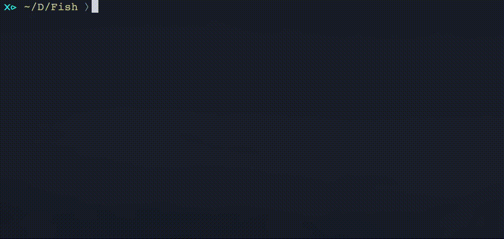

[![Build Status][travis-badge]][travis-link]
[![Slack][slack-badge]][slack-link]

# fish-expand-range
You can expand `{1..9}` in in fish shell!



## Install

With [fisherman]

```
fisher ryotako/fish-expand-range

# If you agree with key bindings to \n and \r, use this branch
fisher ryotako/fish-expand-range:keybindings
```

## Usage
This plugin provides a function `__expand_brace` to replace `{1..3}` into `{1,2,3}` in commandline.
You can make keybinds with this as below.

```
# Expand and execute.
# These key binds are already defined in the keybindings branch 
bind \n 'type -q __expand_range; and __expand_range; commandline -f execute'
bind \r 'type -q __expand_range; and __expand_range; commandline -f execute'

# Expand only
bind \cx __expand_range
```


[travis-link]: https://travis-ci.org/ryotako/fish-expand-range
[travis-badge]: https://img.shields.io/travis/ryotako/fish-expand-range.svg
[slack-link]: https://fisherman-wharf.herokuapp.com
[slack-badge]: https://fisherman-wharf.herokuapp.com/badge.svg
[fisherman]: https://github.com/fisherman/fisherman
